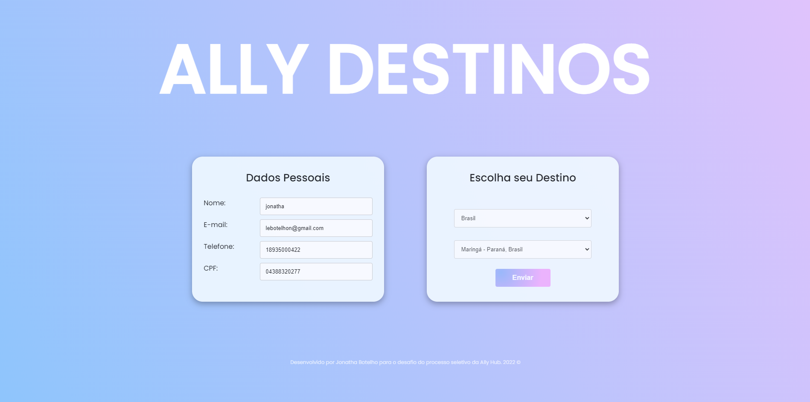

# Ally Destinos

Esse projeto foi criado com o [Create React App](https://github.com/facebook/create-react-app) utilizando React e foi parte de um desafio do processo seletivo da [Ally Hub](https://www.allyhub.co/), no qual era necessário criar uma interface web para marcar destinos de interesse.

O processo da criação dessa interface foi bastante divertida, pois durante o desenvolvimento pude aprender sobre Axios (no qual foi utilizado para fazer a requisição GET da API da Amazon.), React Hook Form para criar o formulário. Também pude me aventurar mais e aprender a fazer uma dropdown List com as requisições que foram feitas da API.

Para esse rodar esse projeto em sua maquina, basta digitar os seguintes comandos no seu terminal:

### `npm install`

Este comando vai baixar todas as dependencias e bibliotecas do projeto.

### `npm start`

Este comando vai rodar o projeto. Irá abrir uma página no: [http://localhost:3000](http://localhost:3000) e você pode verificar ele em seu browser de preferencia.

## Stack
- **JavaScript** (ReactJS com libs: Axios e react-hook-form).

## Coisas que precisam e serão ser implementadas:

- Uma popup de notificação de cadastro de interesse.
- Responsividade da interface para mobiles.
- Algumas máscaras e validações dos campos adicionais no formulário.
- Resetar formulário após submissão.

